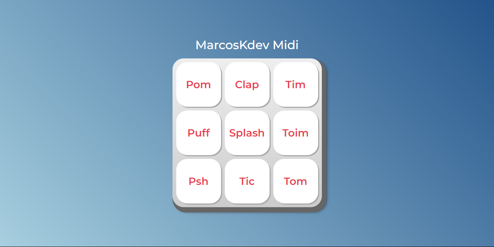

# Projeto MarcosMidi desenvolvido durante o curso da Alura em parceria com o programa Inova Maranhão.

MarcosMidi é uma aplicação web que simula um controlador MIDI. O projeto permite aos usuários criar e tocar suas próprias melodias usando teclas virtuais, proporcionando uma experiência interativa e divertida sobre música digital. Durante o desenvolvimento, aprendi a manipular eventos do teclado e mouse, e a integrar sons para uma resposta imediata ao usuário.


#### Link de visualização do projeto
[Clique aqui para ver o projeto](https://marcoskdev.github.io/projeto-marcosmidi-curso-alura/)
## Stack utilizada

**Front-end:** HTML, CSS e JS

## Caso queira utilizar o projeto como base para seus próprios projetos, fique à vontade.

1 - Clone o Repositório

```
git clone https://github.com/MarcoskDev/projeto-marcosmidi-curso-alura.git
```
2 - Navegue até o Diretório do Projeto
```
cd projeto-marcosmidi-curso-alura
```
3 - Abra o Arquivo index.html em um Navegador:

Você pode simplesmente clicar duas vezes no arquivo index.html para abri-lo diretamente no navegador ou, se preferir, usar o Live Server dentro do VS Code.

## 🔗 Instrutores durante o Curso
### Vanessa Me Tonini
Desenvolvedora Web há mais de 10 anos. Mestranda em Ciência da Computação no IME-USP. Vegetariana, (nem tão) jovem mística, mãe da Yasmin Lis.

[](https://www.linkedin.com/in/vanessametonini/)

[](https://github.com/vanessametonini)
